# 🍥animeproj
- Интернет-сайт для просмотра и обсуждения аниме. | <u>**Мой самый крупный проект на Django**</u>

## Содержание
1. [Установка и запуск проекта](#установка-и-запуск-проекта)
2. [Описание проекта](#описание-проекта)
3. [Скриншоты](#скриншоты)

## Установка и запуск проекта

1. **Клонируйте репозиторий**
   ```bash
    git clone https://github.com/DmitryAce/django_projects/
   ```

2. **Перейдите в папку проекта**
   ```bash
   cd animeproj
   ```

3. **Установите Poetry** (если он еще не установлен)
   ```bash
   pip install poetry
   ```

4. **Установите зависимости проекта**
   ```bash
   poetry install
   ```

5. **Активируйте виртуальное окружение Poetry**
   ```bash
   poetry shell
   ```

6. **Запустите сервер Django**
   ```bash
   python manage.py runserver
   ```

## Описание проекта
Проект **🍥animeproj** представляет собой интернет-платформу для просмотра аниме с возможностью обсуждения, фильтрации и оценки контента.

### Основные особенности проекта:

1. **Цель**: Приложение позволяет пользователям находить аниме по категориям, просматривать динамические списки, получать рекомендации и участвовать в обсуждениях.

2. **Функциональность**:
   - **Фильтры по категориям**: Пользователи могут фильтровать аниме по категориям, количеству просмотров, рейтингам и тд.
   - **Динамические списки просмотров**: Отображение популярных, недавно просмотренных и рекомендуемых аниме.
   - **Подборки**: Рекомендации аниме на основе предпочтений пользователей.
   - **Блог с новостями**: Раздел для публикации новостей и статей об аниме, манге и событиях.
   - **Личный профиль**: Каждый пользователь имеет личный профиль с возможностью создания списка избранного.
   - **Чат и обсуждения**: Возможность вести беседы с другими участниками платформы, обсуждая аниме и делясь мнениями.
   - **Отзывы и оценки**: Пользователи могут оставлять и читать отзывы об аниме, делясь своим мнением с сообществом.

3. **Технологии**:
   - **Django REST Framework**: Обеспечивает API для взаимодействия с фронтендом и мобильными приложениями.
   - **Swagger**: Интегрирован для автоматической генерации и документации API, упрощая тестирование и взаимодействие с API.

4. **Структура**: Проект включает модели для аниме, пользователей, сообщений и блога. В приложении используются представления и формы Django для управления данными, а также Django REST Framework для реализации API.

\**суперпользователь admin:admin*

## Скриншоты
### Главная страница
- Карусель трендов

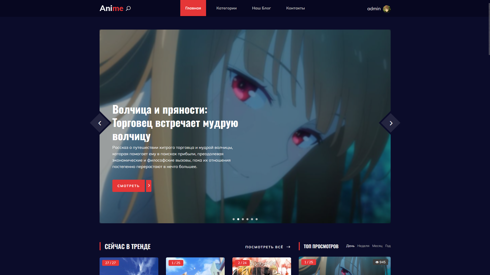

- Список трендов

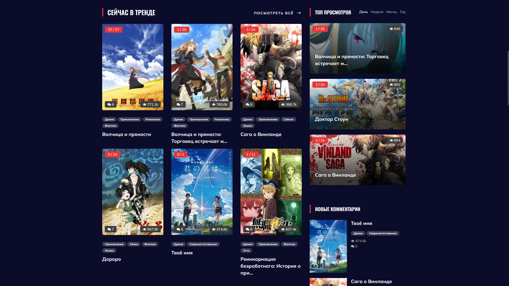

- Остальные категории


- Посмотреть всё


- Результаты поиска по запросу http://127.0.0.1:8000/Волч

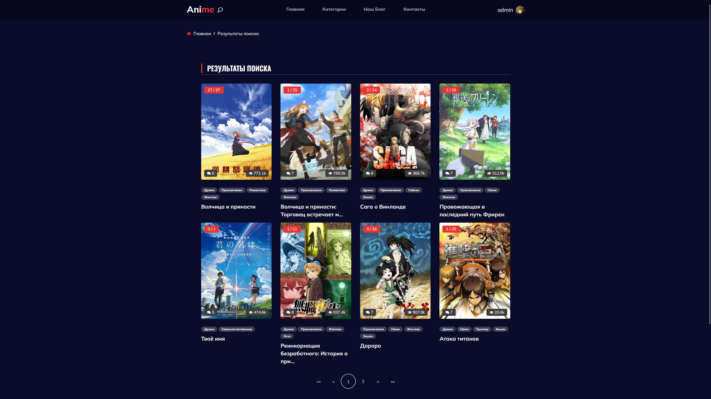

### Аниме
- Описание + основной функционал

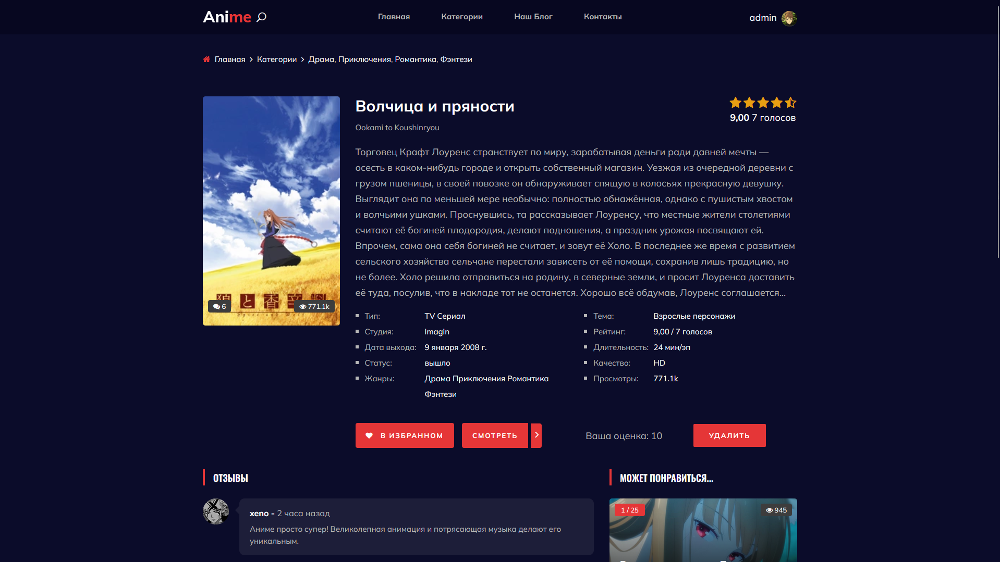

- Отзывы и рекомендации

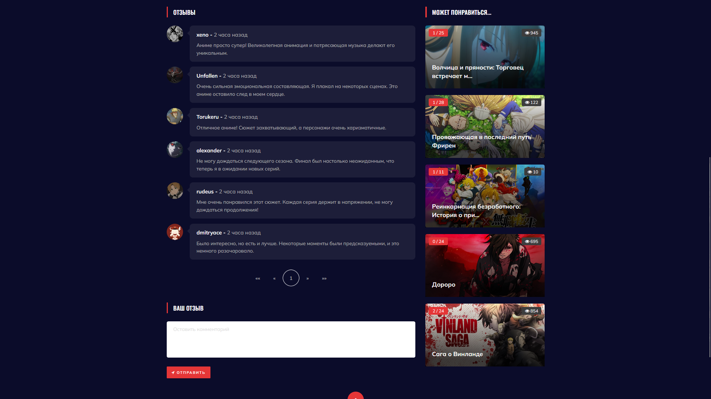

Если нужно что-то изменить или добавить, дайте знать!

- Страница просмотра


- Типовая страница любой категории с сортировкой, фильтрацией и пагинацией.

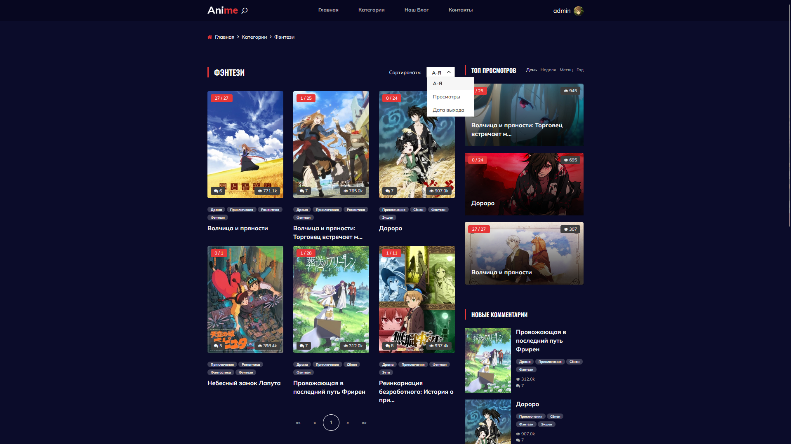

### Пользователь
- Вход

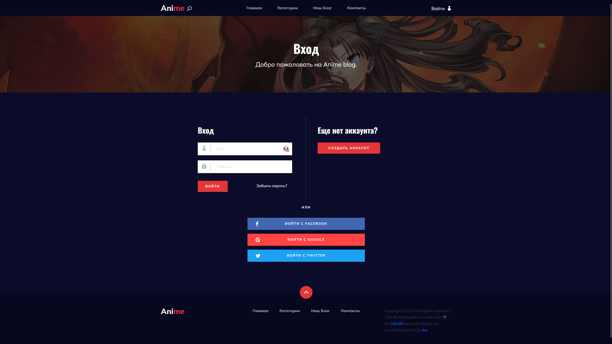

- Регистрация

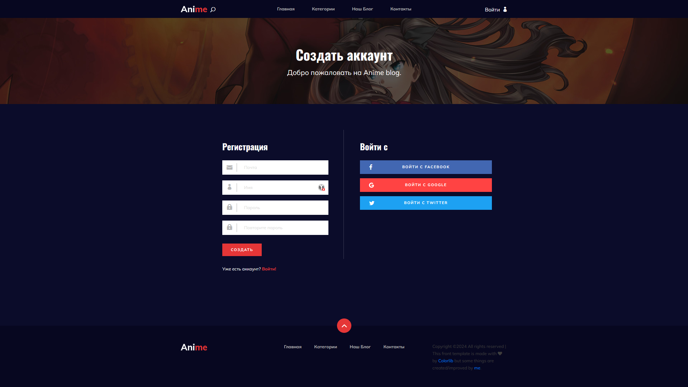

- Профиль пользователя со списком избранного

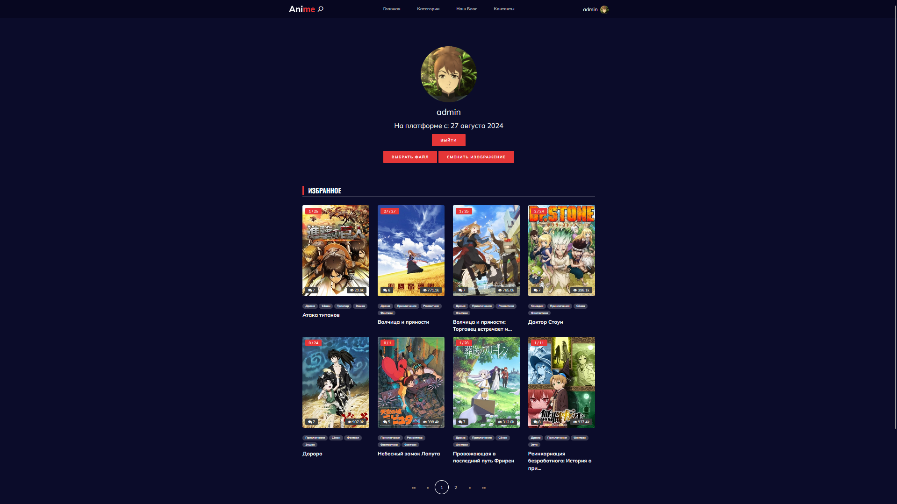

- Чужой профиль

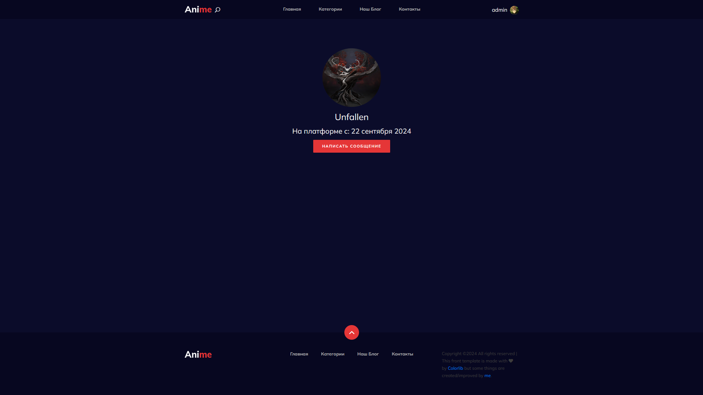

- Страница инициализации диалога между пользователями

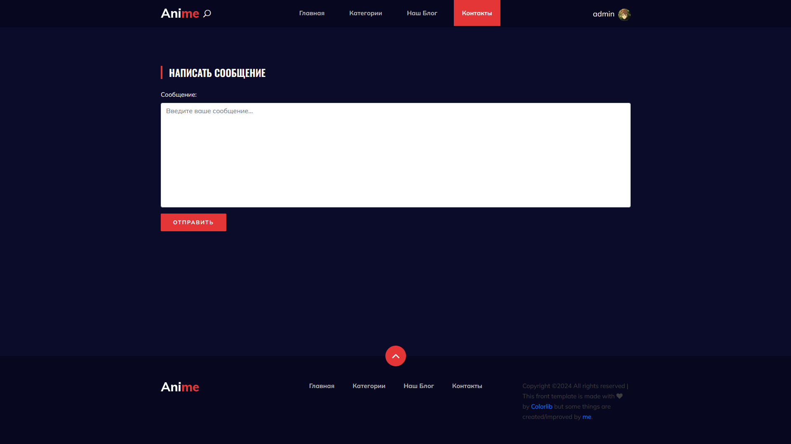

- Контакты пользователя

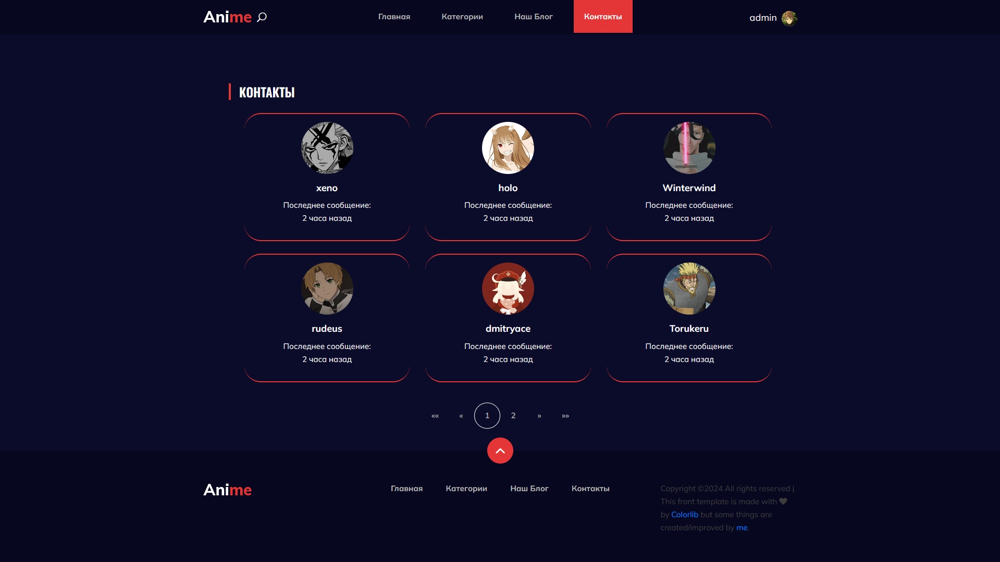

- Диалог с пользователем

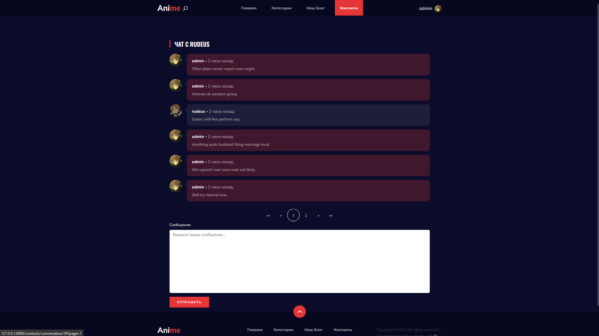

### Блог
- Блог сайта

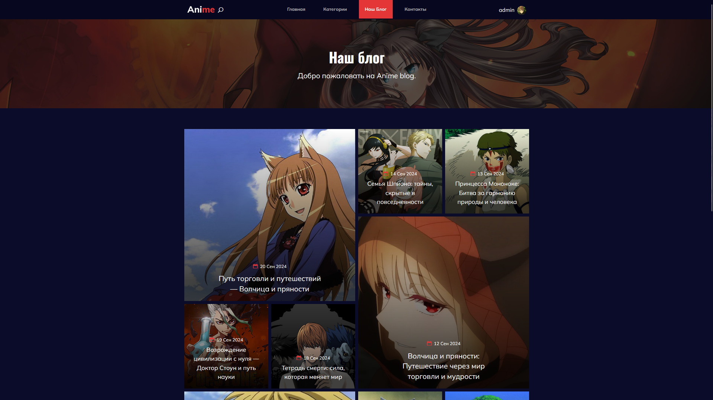

- Примеры деталей блога


### Дополнительно
#### Комманды
В тестовом режиме для упрощения наполнения базы данных были созданы дополнительные команды, позволяющие генерировать случайные комментарии, рейтинги, диалоги, просмотры аниме, а также комментарии к блогам:

1. **Добавление случайных комментариев к аниме**:
   Команда `add_random_comments` добавляет случайные комментарии к каждому аниме от каждого пользователя с настраиваемой вероятностью. В пуле содержится набор типичных комментариев, которые случайным образом присваиваются к аниме.
   Пример использования: 
   ```bash
   python manage.py add_random_comments --comment-chance 0.3
   ```
   
2. **Генерация случайных рейтингов для аниме**:
   Команда `add_random_ratings` присваивает случайные рейтинги аниме от каждого пользователя. Можно указать минимальное и максимальное значение рейтинга.
   Пример использования:
   ```bash
   python manage.py add_random_ratings --min-rating 4 --max-rating 10
   ```

3. **Создание случайных бесед и сообщений**:
   Команда `create_conversations` создает случайные беседы между пользователями и генерирует для них сообщения. Сообщения создаются с помощью библиотеки Faker, которая генерирует случайные тексты.
   Пример использования:
   ```bash
   python manage.py create_conversations
   ```

4. **Заполнение комментариями к блогу**:
   Команда `fill_blogs` добавляет случайные комментарии к каждому посту блога. Пользователи выбираются случайным образом, а комментарии генерируются из заранее подготовленного списка.
   Пример использования:
   ```bash
   python manage.py fill_blogs
   ```

5. **Генерация случайных просмотров аниме**:
   Команда `generate_views` создает реалистичные данные по количеству просмотров аниме. Она генерирует ежедневные, недельные, месячные и годовые просмотры, обновляя информацию о просмотрах для каждого аниме.
   Пример использования:
   ```bash
   python manage.py generate_views
   ```

Эти команды упрощают тестирование, наполняя базу данных данными для более реалистичной работы приложения.

\**Поскольку все данные были заполнены одновременно, даты создания везде одинаковы, так как они были сгенерированы автоматически в один момент. Однако при добавлении новых данных станет очевидно, что система работает корректно.*

#### Ежедневная обработка просмотров
В проекте реализована система автоматического обновления счетчиков просмотров аниме посредством использования крон-команд и планировщика задач. Это обеспечивает регулярное сбросы просмотров для дневных, недельных, месячных и годовых периодов.

1. **Автоматический сброс счетчиков при запуске сервера**:
   При каждом старте сервера проверяется дата последнего сброса счетчиков просмотров, которая хранится в переменной окружения `.env`. Если текущая дата отличается от даты последнего сброса, запускается команда `reset_view_counters`, которая обнуляет счетчики, и обновляется значение переменной `LAST_RESET_DATE` в `.env` файле.

   Пример вызова:
   ```python
   daily.my_post_migrate_handler()  # Выполняется при старте сервера
   ```

2. **Планировщик задач APScheduler**:
   Используется планировщик задач на основе библиотеки **APScheduler** для ежедневного автоматического сброса просмотров. Команда `my_post_migrate_handler` запускается каждый день в 00:00 по московскому времени с помощью крон-триггера.

   Пример вызова:
   ```python
   from apscheduler.schedulers.background import BackgroundScheduler
   from apscheduler.triggers.cron import CronTrigger

   def start():
       scheduler = BackgroundScheduler()
       scheduler.add_job(
           daily.my_post_migrate_handler,
           trigger=CronTrigger(hour=0, minute=0),  # Запуск каждый день в полночь
           id='refresh_views'
       )
       scheduler.start()
   ```

Эта система обеспечивает автоматическое обновление и сброс статистики просмотров аниме, что позволяет поддерживать актуальность данных для различных временных периодов без необходимости ручного вмешательства.