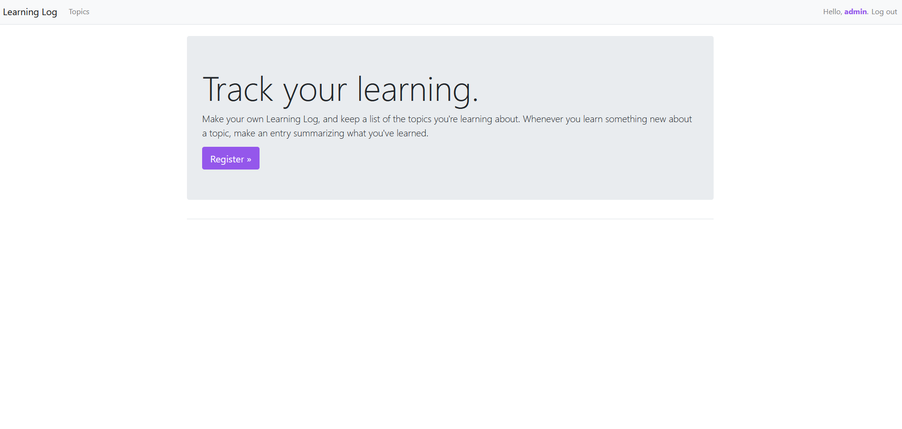

# learningLog
- Мой первый проект на **Django.**
## Содержание
1. [Установка и запуск проекта](#установка-и-запуск-проекта)
2. [Описание проекта](#описание-проекта)
3. [Скриншоты](#скриншоты)

## Установка и запуск проекта
1. Клонируем репозиторий
```bash
git clone https://github.com/DmitryAce/django_projects/
```
2. Переходим в папку проекта
```bash
cd django_projects/learninglog
```
3. Создаём виртуальное окружение Python
```bash
python -m venv env
```
4. Активируем среду
```bash
env\Scripts\activate
```
5. Устанавливаем зависимости
```bash
pip install -r requirements.txt
```
6. Запускаем проект
```bash
python manage.py runserver
```

## Описание проекта
Проект **Learning Log** представляет собой простое веб-приложение на Django, которое позволяет пользователям вести личный дневник записей о своем обучении.

### Основные особенности проекта:
1. **Цель**: Приложение позволяет пользователям регистрироваться, создавать темы и добавлять записи, описывая свой процесс обучения.
2. **Функциональность**:
   - **Темы**: Пользователи могут создавать темы, которые представляют собой категории (например, "Изучение Django").
   - **Записи**: В каждой теме можно добавлять записи с текстом о том, что было выучено или сделано.
   - **Аутентификация**: Пользователи могут регистрироваться и логиниться, чтобы управлять своими темами и записями.
   - **CRUD-операции**: Приложение поддерживает создание, просмотр, обновление и удаление тем и записей.
3. **Структура**: Проект состоит из моделей, форм и представлений Django, с использованием базовых методов работы с ORM и админкой Django.

\**суперпользователь admin:admin*
## Скриншоты



