# 🍇puddle
- Интернет-сайт для размещения объявлений о продаже товаров. 
## Содержание
1. [Установка и запуск проекта](#установка-и-запуск-проекта)
2. [Описание проекта](#описание-проекта)
3. [Скриншоты](#скриншоты)

## Установка и запуск проекта

1. **Клонируйте репозиторий**
   ```bash
   git clone https://github.com/DmitryAce/django_projects/
   ```

2. **Перейдите в папку проекта**
   ```bash
   cd django_projects/puddle
   ```

3. **Установите Poetry** (если он еще не установлен)
   ```bash
   pip install poetry
   ```

4. **Установите зависимости проекта**
   ```bash
   poetry install
   ```

5. **Активируйте виртуальное окружение Poetry**
   ```bash
   poetry shell
   ```

6. **Запустите сервер Django**
   ```bash
   python manage.py runserver
   ```

## Описание проекта
Проект **🍇Puddle** представляет собой интернет-платформу для покупки и продажи товаров, с поддержкой различных категорий и функций для взаимодействия между покупателями и продавцами.
### Основные особенности проекта:

1. **Цель**: Приложение предоставляет пользователям возможность просматривать товары, фильтровать результаты поиска и взаимодействовать с продавцами. Пользователи могут регистрироваться, искать товары, просматривать их категории и общаться через встроенные диалоги.

2. **Функциональность**:
   - **Категории товаров**: Товары организованы по категориям для удобства поиска и навигации.
   - **Поиск с фильтрами**: Пользователи могут искать товары по различным критериям и фильтрам, таким как название и категория.
   - **Диалоги с продавцами**: Встроенная система сообщений позволяет покупателям и продавцам общаться напрямую для обсуждения деталей сделок.
   - **Ролевая модель**:
     - **Администратор**: Управляет пользователями, товарами и категориями. Имеет доступ ко всем административным функциям.
     - **Покупатель**: Может просматривать товары, использовать поиск и фильтры, общаться с продавцами и делать покупки.
     - **Продавец**: Может добавлять и управлять своими товарами, общаться с покупателями и отслеживать свои продажи.
     - **Гибкость ролей**: Каждый зарегистрированный пользователь может быть как покупателем, так и продавцом.

3. **Технологии**:
   - **Tailwind CSS**: Используется для стилизации интерфейса, предоставляя современный и отзывчивый дизайн.
   - **Django REST Framework**: Предоставляет API для взаимодействия с фронтендом и мобильными приложениями.
   - **Swagger**: Интегрирован для автоматической генерации и документации API, упрощая тестирование и взаимодействие с API.

4. **Структура**: Проект включает модели для товаров, пользователей, сообщений и категорий. В приложении используются представления и формы Django для управления данными, а также Django REST Framework для реализации API.

\**суперпользователь admin:admin*

## Скриншоты
### Главная страница
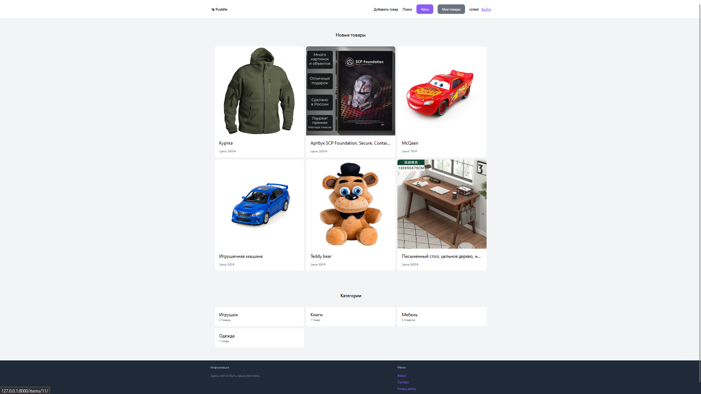
### Товары конкретной категории
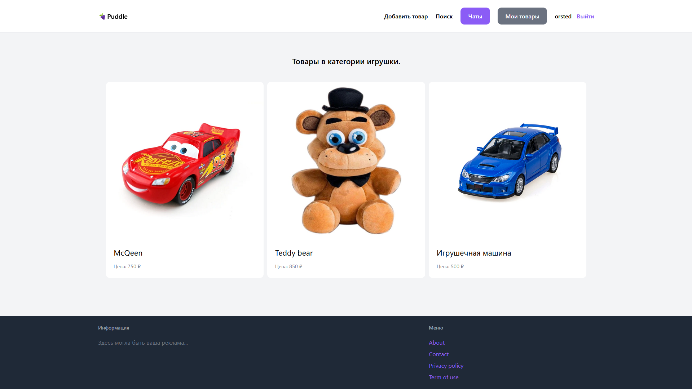
### Страница товара
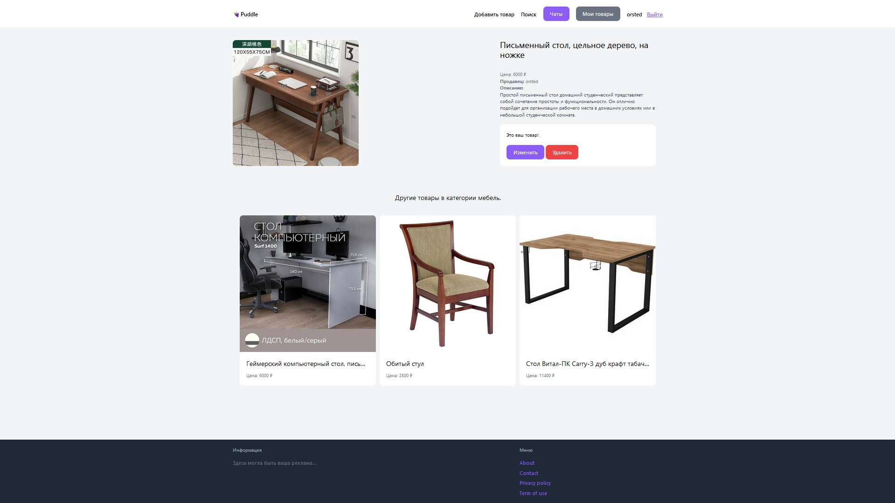
### Страница добавления товара
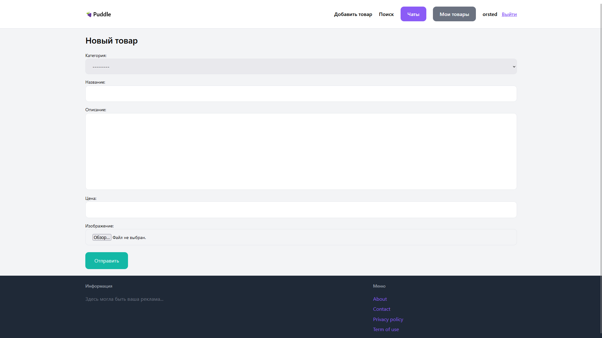
### Поиск с фильтрацией
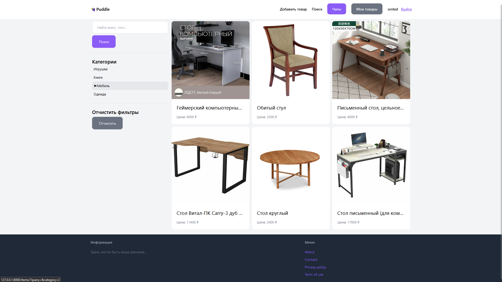
### Раздел "Мои товары"
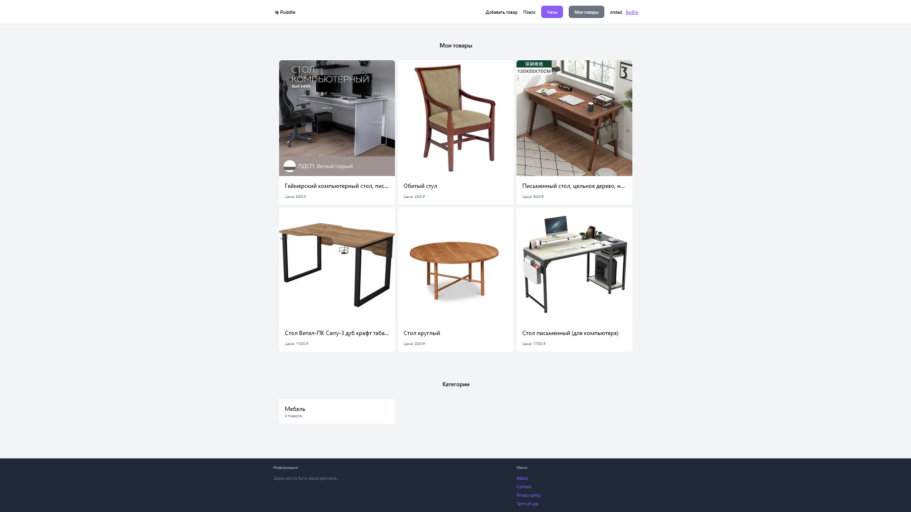
### Выбранная категория персональных товаров
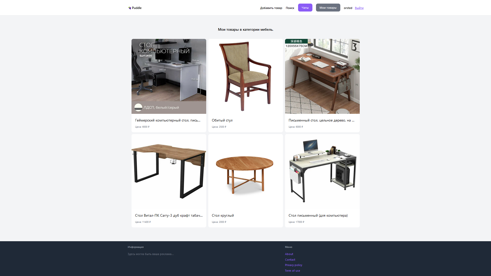
### Вид страницы товара от лица не авторизованного человека
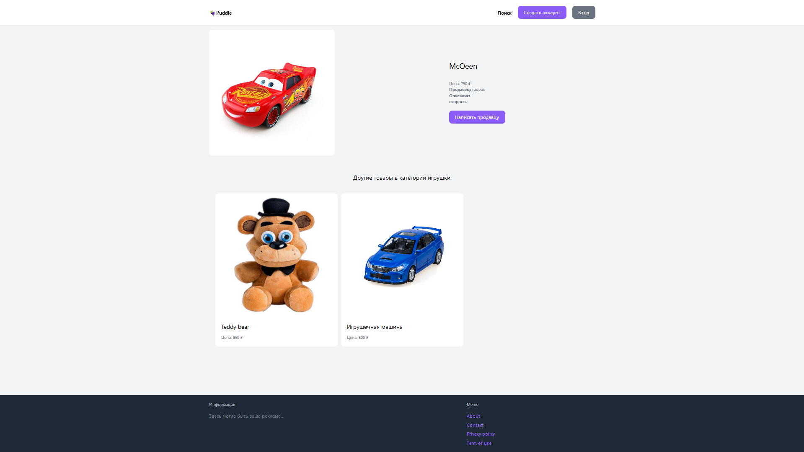
### Вид страницы товара от лица владельца товара
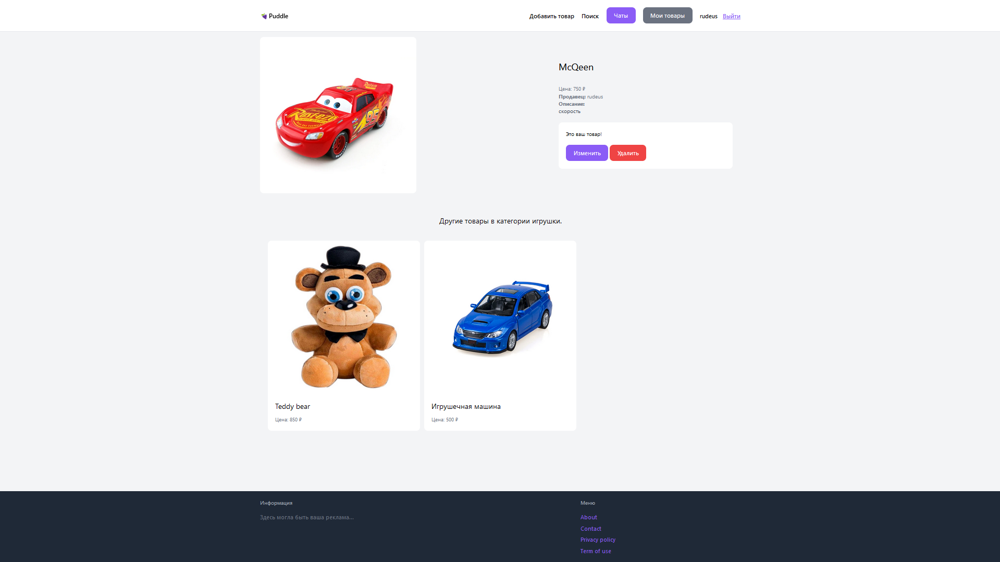
### Вид страницы товара от лица другого авторизованного человека
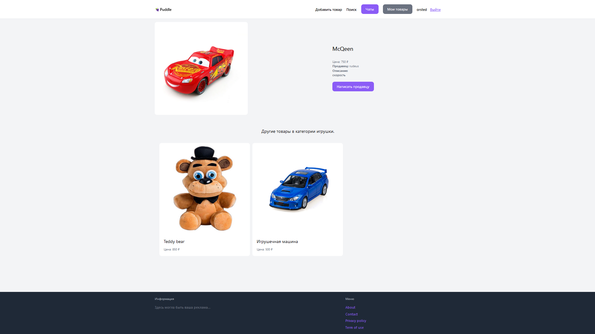
### Вид страницы товара от лица администратора
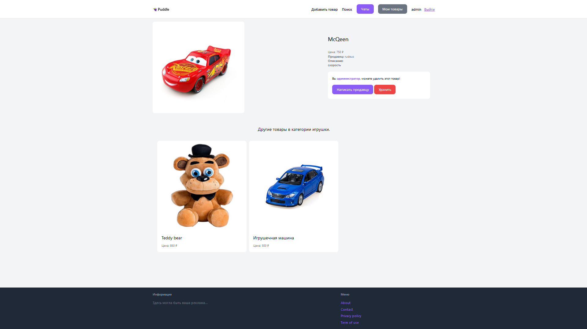
### Персональные диалоги с клиентами\покупателями
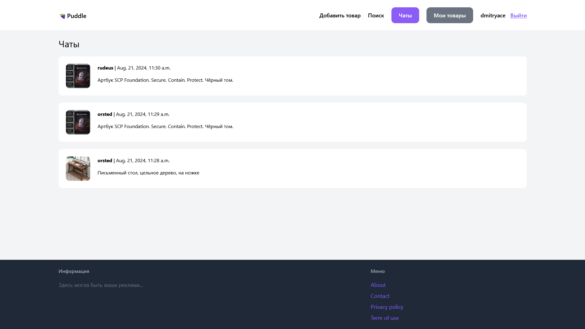
### Диалог
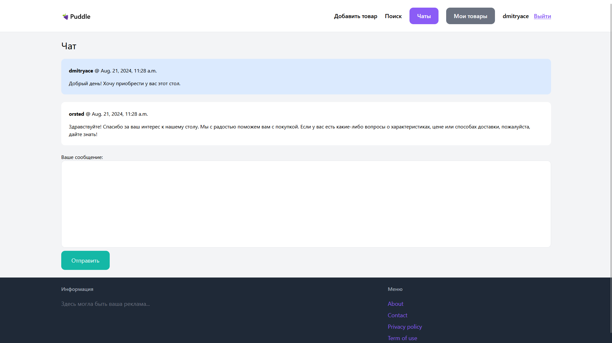
### Регистрация
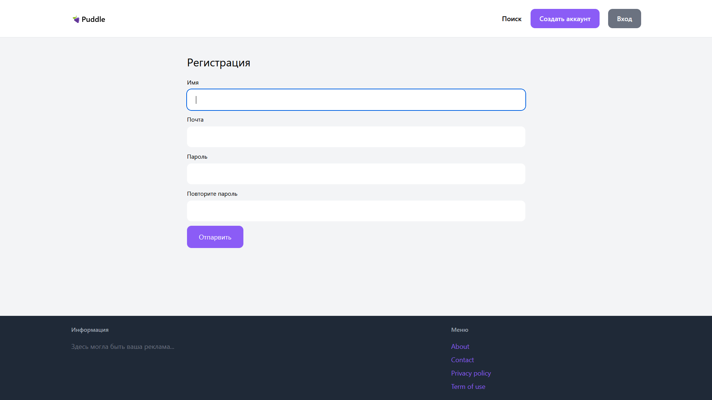
### Вход
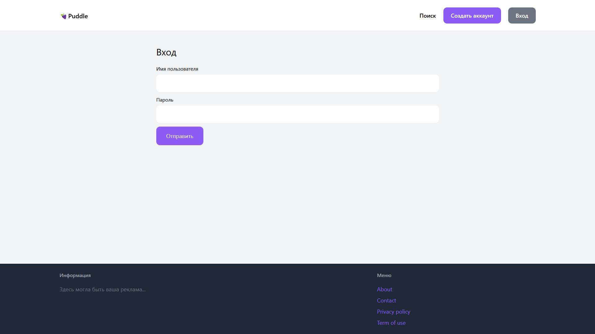
### Контакты
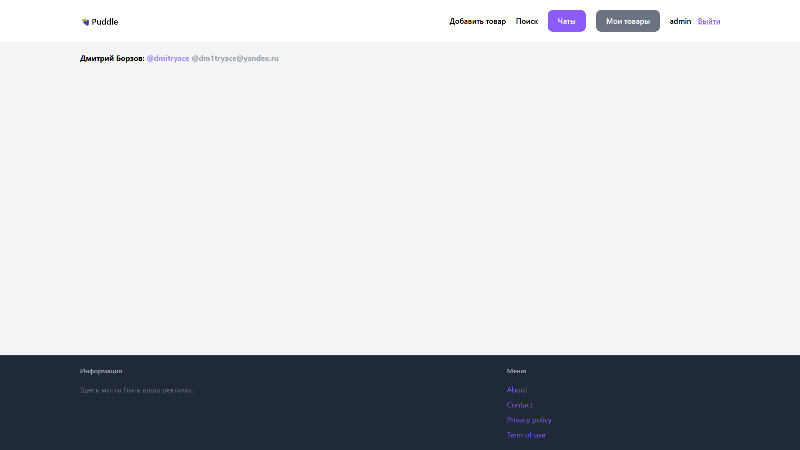
### Django administration
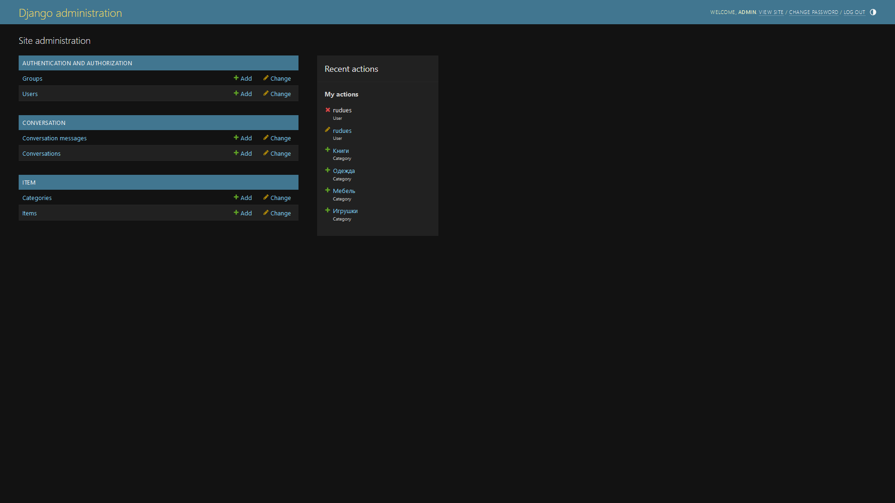